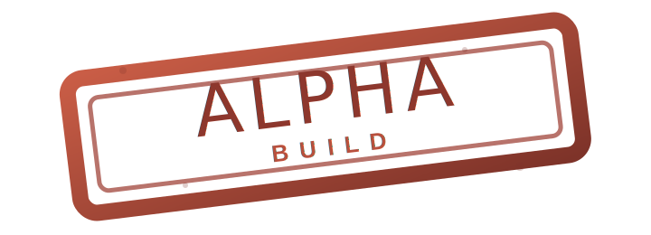
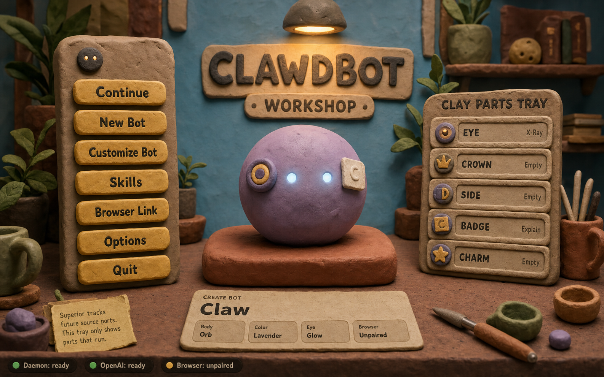
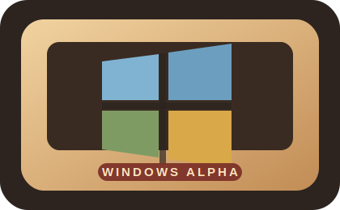
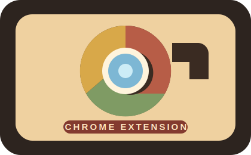
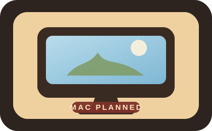
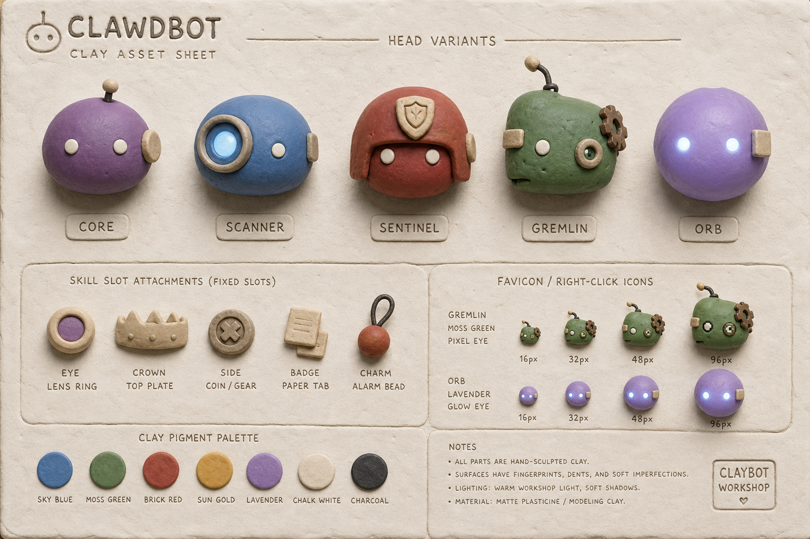

# SUPERIOR

<p align="center">
  
</p>

SUPERIOR is an alpha signal-analysis console with a Godot visual engine, browser companion, and local server brain. It should feel like a game console OS that reacts to browser, repo, and agent signals.



## Platforms

| Windows EXE | Chrome Extension | macOS |
| --- | --- | --- |
|  |  |  |
| Alpha MSI | Chrome alpha | Soon |
| [Download MSI](https://github.com/Zwin-ux/superior-alpha/releases/tag/v0.8.0-alpha) | [Download ZIP](https://github.com/Zwin-ux/superior-alpha/releases/tag/v0.8.0-alpha) | Soon |

## Showpiece

| Workshop Target | Bot / Parts Sheet |
| --- | --- |
|  |  |

## Proof

| Gate | Command / File |
| --- | --- |
| Root checks | `corepack pnpm typecheck && corepack pnpm test && corepack pnpm build` |
| Godot scaffold | `corepack pnpm superior:engine-check` |
| Realtime server | `corepack pnpm superior:server` |
| Chrome store packet | `corepack pnpm extension:store-package` |
| Extension skill fixture | `.clawdbot/verification/extension-skill-fixture-1780164331918.json` |
| Windows install loop | `corepack pnpm windows:beta-gate` |
| Release proof packet | [docs/release-proof-packet.md](docs/release-proof-packet.md) |
| Alpha release | [v0.8.0-alpha](https://github.com/Zwin-ux/superior-alpha/releases/tag/v0.8.0-alpha) |
| Verification log | [docs/alpha-verification.md](docs/alpha-verification.md) |

## Hub

| Start Here | Purpose |
| --- | --- |
| [Release Ladder](docs/release-ladder.md) | Current alpha path to `1.0` beta |
| [Build Plan](docs/build-plan.md) | What the next agent should build |
| [Release Proof Packet](docs/release-proof-packet.md) | Current alpha proof artifacts, commands, and caveats |
| [Notion Alpha Template](docs/notion-alpha-template.md) | Working plan mirror for alpha tasks, gates, risks, evidence |
| [Godot Engine Direction](docs/superior-alpha-engine.md) | Primary runtime direction |
| [Chrome Store Packet](docs/chrome-web-store-listing.md) | Public extension listing prep |
| [Privacy Policy Source](docs/extension-privacy.md) | GitHub-hosted privacy doc source |
| [Issues](https://github.com/Zwin-ux/superior-alpha/issues) | Public support and alpha feedback |
| [Platform Testing](docs/platform-release-testing.md) | Gates for Windows, extension, service, hub, and mobile |
| [Operating Principles](docs/operating-principles.md) | Taste and product rules |

## Local Commands

```powershell
corepack pnpm install
corepack pnpm typecheck
corepack pnpm test
corepack pnpm build
corepack pnpm superior:engine-check
corepack pnpm superior:server
corepack pnpm extension:store-package
corepack pnpm windows:beta-gate
```

Local state, keys, pairing tokens, browser profiles, and artifacts stay out of Git.
