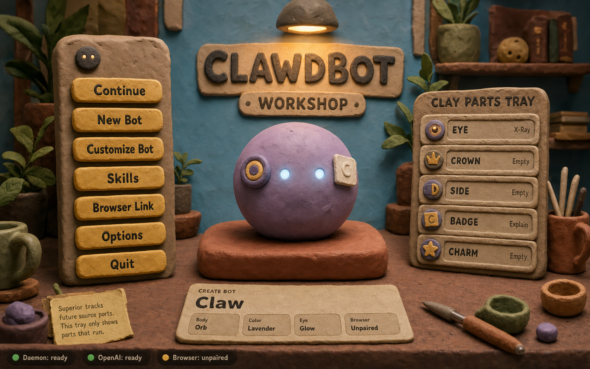
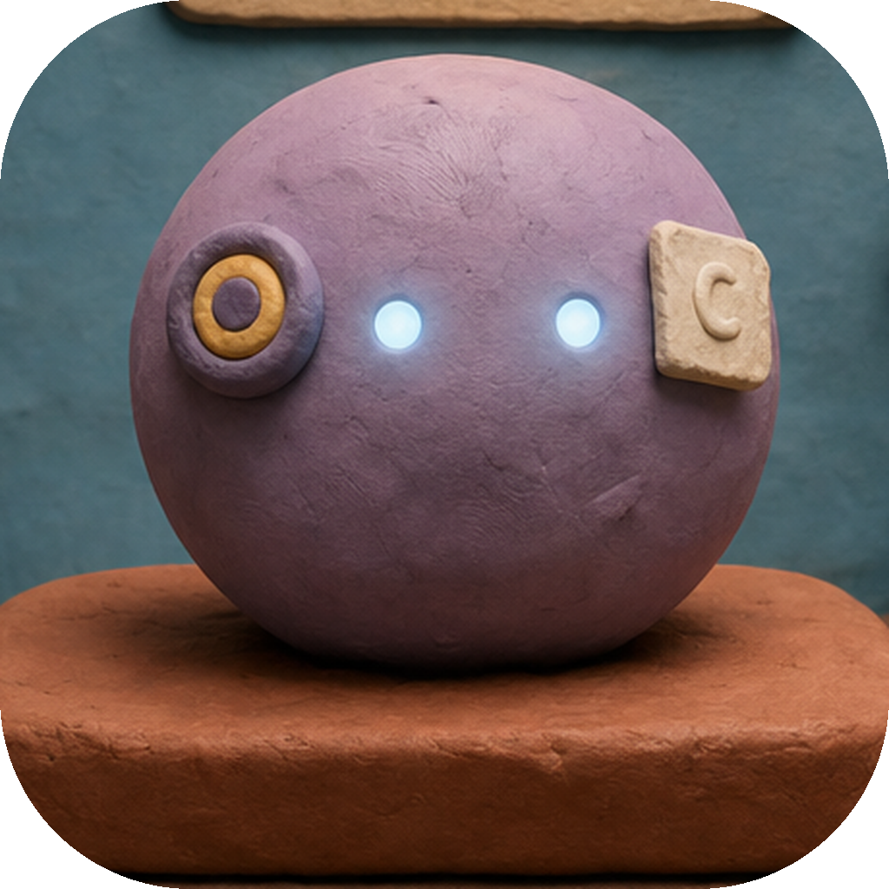
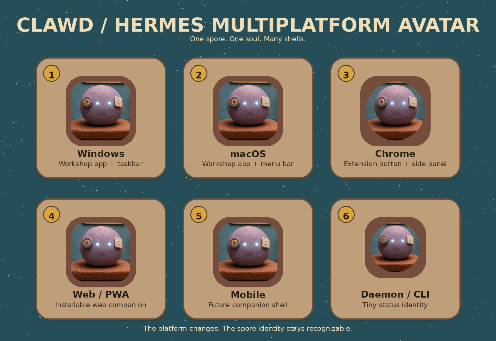

# Clawdbot / Hermes Project Soul Brief

> **Purpose:** give Codex the soul of the project, not just a task list.
>
> Clawdbot should feel like a small handmade companion that can be grown, taught, paired, and carried across platforms. The user should not feel like they are configuring another generic AI app. They should feel like they are building a living helper in a clay workshop.



---

## 1. The one-sentence product direction

**Clawdbot is a clay-workshop companion system: the user creates a bot once, gives it skills and parts, then carries that same bot into Windows, macOS, Chrome, the browser, and future surfaces through a portable “spore” identity.**

This project should feel warm, physical, playful, and useful. The technical layer can be serious, but the experience should feel like the user is shaping a companion rather than managing settings.

---

## 2. The soul

The core fantasy is simple:

**I made a little bot. It remembers its shape. I can teach it skills. I can plug it into my browser. I can bring it with me across devices.**

The bot is not just a chat window. It has a body, a name, visible status, parts, skills, and a home base. The workshop is where it is created, repaired, upgraded, paired, and understood.

The art direction matters because it gives the software a personality before any feature is explained. A normal desktop app says “tool.” This says “companion.” That difference should guide every product and engineering choice.

---

## 3. The reference avatar and icon direction

The central lavender clay orb is the first reusable identity mark for the project. Treat it as the starter avatar for **Clawd** and the shared recognizable face of the system.



The avatar should remain recognizable across platforms. Each platform can crop, mask, badge, or resize it, but the bot should still feel like the same being.



Starter icon assets are included in this package:

| Use | Asset |
| --- | --- |
| Shared source avatar | `../assets/bots/soul/icons/clawd-avatar-1024.png` |
| Windows app / taskbar | `../assets/bots/soul/icons/clawd-windows.ico` and `../assets/bots/soul/icons/clawd-windows-256.png` |
| macOS app starter icon | `../assets/bots/soul/icons/clawd-macos-1024.png` |
| Chrome extension icon | `../assets/bots/soul/icons/chrome-extension-icon-16.png`, `32.png`, `48.png`, `128.png` |
| PWA / web app | `../assets/bots/soul/icons/clawd-pwa-512.png` |
| Future mobile shell | `../assets/bots/soul/icons/clawd-mobile-512.png` |
| Daemon / CLI status mark | `../assets/bots/soul/icons/clawd-daemon-64.png` |

These are starter assets cropped from the target artwork. They are good enough to establish direction and keep early builds visually unified. A final brand pass can replace them later, but do not let each platform invent a different identity.

---

## 4. Clawd, Hermes, and the Spore model

### Clawd

**Clawd** is the embodied bot. It is the thing the user sees, names, customizes, teaches, and carries around. Clawd lives in the workshop, appears in desktop shells, and becomes the user’s familiar assistant.

Clawd’s job is to feel present. It should blink, glow, wobble, react to connection status, and show its equipped parts.

### Hermes

**Hermes** is the messenger and bridge layer. Hermes connects Clawd to the browser, extension, web surfaces, local daemon, and future platform shells.

Hermes should not feel like a separate product. It is the delivery system: the little courier that lets the same bot travel.

### The Spore

A **spore** is the portable seed of a bot. It is not the entire app. It is the bot’s identity bundle.

A spore should answer:

- Who is this bot?
- What does it look like?
- What skills does it have?
- What platform pairings does it know about?
- What safe preferences can move with it?
- What version of the schema does it use?

A spore should not contain raw secrets. Tokens, API keys, and OS-specific credentials should live in secure platform storage. The spore can hold safe references, pairing IDs, capability flags, and display state.

Conceptually:

```ts
export type BotSpore = {
  schemaVersion: string;
  id: string;
  name: string;
  species: "clawd" | "hermes";

  appearance: {
    body: "orb" | "blob" | "cube" | "custom";
    color: "lavender" | "ochre" | "teal" | "clay" | string;
    eye: "glow" | "xray" | "sleepy" | "custom";
    crown?: string;
    side?: string;
    badge?: string;
    charm?: string;
    avatarAsset: string;
  };

  skills: Array<{
    id: string;
    label: string;
    enabled: boolean;
    source: "local" | "extension" | "cloud" | "dev";
  }>;

  pairings: {
    browser?: PairingState;
    windows?: PairingState;
    macos?: PairingState;
    chromeExtension?: PairingState;
    web?: PairingState;
  };

  preferences: {
    animationIntensity: "low" | "medium" | "high";
    voice?: string;
    theme: "clay-workshop";
  };

  createdAt: string;
  updatedAt: string;
};

export type PairingState = {
  status: "unpaired" | "pairing" | "ready" | "error";
  safePairingId?: string;
  lastSeenAt?: string;
};
```

Codex should treat this schema as a starting point, not a prison. The key idea is that the user’s bot can travel without being rebuilt from scratch on each platform.

---

## 5. Platform map

Keep the platform story extremely simple: **one spore, many shells.**

1. **Windows Workshop App**  
   The first flagship shell. This is the main clay workshop where the user creates Clawd, edits parts, checks daemon/OpenAI/browser status, and pairs the browser.

2. **macOS Workshop App**  
   Same workshop metaphor, adapted to macOS. It should use the same bot identity, same spore schema, and same icon/avatar direction.

3. **Chrome Extension**  
   The browser surface. The user should be able to add Clawd to Chrome, pair it with the desktop daemon, and use browser-aware skills. The extension should feel like the bot reaching into the web, not like a separate product.

4. **Browser Side Panel / Web Companion**  
   A lightweight browser UI for quick actions, page context, summaries, and skill triggers. This can be powered by the Chrome extension first, then generalized later.

5. **Local Daemon**  
   The quiet background worker. It handles local readiness, app-to-extension communication, model/tool routing, and status reporting. In the UI, it appears as a simple status pill: `Daemon: ready`.

6. **Web / PWA Shell**  
   A portable version of the workshop or companion panel. Useful for account management, sharing a bot profile, or opening the spore when the desktop app is not installed.

7. **CLI / Developer Shell**  
   A practical developer interface for debugging spore state, pairings, skills, logs, and local services. This can be plain, but it should still use the same naming and identity.

8. **VS Code / Codex-facing Dev Surface**  
   A future developer-facing surface where Clawd can help with project tasks, show status, and use configured skills. This should still connect back to the same spore identity.

9. **Mobile Companion: iOS / Android Later**  
   Not the first milestone, but the spore model should make it possible. Mobile should be a companion shell, not a separate bot universe.

10. **Cloud Sync / Hermes Relay Later**  
   Optional future layer for carrying safe bot state across machines. Use this only after local-first behavior works. The product should not depend on cloud sync to feel alive.

---

## 6. The workshop UI target

The reference image is the visual north star.

The first Windows build should match this composition:

- Left clay menu: `Continue`, `New Bot`, `Customize Bot`, `Skills`, `Browser Link`, `Options`, `Quit`
- Center: Clawd preview on a clay pedestal
- Top center: `CLAWDBOT WORKSHOP` sign under a warm lamp
- Right side: `CLAY PARTS TRAY`
- Bottom center: bot config card showing current body, color, eye, and browser status
- Bottom edge: status pills for daemon, OpenAI, and browser pairing

The UI should be built as layered components, not a single flat screenshot.

Suggested components:

```txt
SceneBackground
WorkshopSign
ClayButton
ClayPanel
ClayStatusPill
BotPreview
PartsTray
BotConfigCard
BrowserLinkPanel
SkillShelf
SporeImporter
SporeExporter
```

Design rules:

- Rounded clay edges
- Slight asymmetry
- Visible handmade texture
- Warm shadows
- Big readable labels
- Physical hover and press states
- Soft lamp glow
- No sterile SaaS dashboards on the main surface

---

## 7. Interaction language

Use workshop language instead of generic settings language.

| Generic software language | Clawdbot language |
| --- | --- |
| Settings | Options / Workbench |
| Plugin | Skill |
| Account connection | Pairing |
| Profile export | Spore export |
| Profile import | Plant spore |
| Browser auth | Browser Link |
| Add-on | Part / Charm / Badge |
| Status indicator | Workshop signal |
| Assistant config | Bot card |

This is not just cute copy. It keeps the product understandable. Users should know what is happening because the metaphor is physical.

---

## 8. Future animation direction

Animation should make the bot feel alive, not noisy.

1. **Idle bot animation**  
   Clawd gently breathes or wobbles like soft clay. It should feel stop-motion, not robotic.

2. **Eye glow**  
   Eyes pulse when the daemon, OpenAI, or browser link is active. Eyes dim when disconnected.

3. **Clay button press**  
   Buttons squash down when clicked and spring back softly.

4. **Parts tray equip animation**  
   Selected parts pop, slide, or wobble from the tray onto the bot.

5. **New bot creation**  
   A lump of clay forms into an orb on the pedestal.

6. **Browser pairing**  
   A little clay cable, plug, or Hermes badge connects the desktop app to the browser extension.

7. **Status pills**  
   Dots transition from amber/red to green. On success, pulse once.

8. **Skill shelf**  
   Skills appear as clay tokens, tools, charms, or stamps the bot can equip.

9. **Hermes travel animation**  
   When the same spore appears on another platform, show the avatar as if it has been planted there.

10. **Low-motion mode**  
   Every animation should have a calm reduced-motion version.

---

## 9. Engineering direction

Suggested structure:

```txt
/apps
  /windows-workshop
  /macos-workshop
  /chrome-extension
  /web-companion
  /daemon
  /cli

/packages
  /spore-core
  /clay-ui
  /clawd-avatar
  /hermes-bridge
  /skills-core
  /platform-registry
```

### `spore-core`

Owns the `BotSpore` schema, validation, migrations, import/export, and safe serialization.

### `clay-ui`

Shared visual components: buttons, panels, cards, status pills, tray rows, signs, hover states, press states, and animation primitives.

### `clawd-avatar`

Owns avatar rendering, icon selection, platform masking, bot preview state, equipped parts, and idle animations.

### `hermes-bridge`

Owns pairing flows, browser link state, message passing, and platform handoff.

### `skills-core`

Owns skill registration, skill metadata, enable/disable state, and how skills appear as clay objects.

### `platform-registry`

Defines which surfaces exist, what they support, and how the same spore should appear on each one.

---

## 10. First build milestone

Do not start by building every platform. Start by proving the identity is real.

Milestone 1:

1. Start with an empty bench.
2. Let the user choose a shape: `Orb`, `Gremlin`, `Scanner`, `Sentinel`, or `Core`.
3. Let the user set the first loadout: `Eye`, `Badge`, `Side`, and later `Crown` / `Charm`.
4. Create the static Windows workshop scene.
5. Use the avatar/icon assets in the app window and taskbar.
6. Show the central Clawd preview.
7. Show status pills: `Daemon: ready`, `OpenAI: ready`, `Browser: unpaired`.
8. Show the parts tray.
9. Add hover and pressed states to clay buttons.
10. Define the first `BotSpore` schema.
11. Save/load one local spore.
12. Make `Browser Link` open a placeholder pairing panel.
13. Keep the code modular enough that Chrome and macOS can reuse the same spore and avatar.

Milestone 1 is successful when the app feels like the screenshot even before the deeper features are finished.

## 10A. Onboarding Shape Rule

The onboarding fantasy should feel like a starter-creature moment, not a settings form.

Flow:

```text
empty bench -> choose shape -> choose skills -> name -> save spore
```

Presets like `Clawd`, `Hermes`, and `Mote` are seeds under the hood. The user-facing moment is choosing the creature shape and fitting useful parts.

The skill setup should read like a JRPG loadout:

- `Eye`: page reading and extraction tools.
- `Badge`: explanation or proof tools.
- `Side`: repo/workbench tools.
- `Crown`: later knowledge or transcript tools.
- `Charm`: later monitor and notifier tools.

---

## 11. Second build milestone

Milestone 2 turns the workshop into a system:

1. Implement spore import/export.
2. Implement real browser pairing state.
3. Build the first Chrome extension shell.
4. Use the same avatar inside the extension.
5. Show whether the extension is paired to the desktop daemon.
6. Let one simple skill work from the browser surface.
7. Update the Windows workshop when browser state changes.
8. Add basic bot idle animation.

Milestone 2 is successful when the user can say: **“I made Clawd on Windows, then added that same Clawd to Chrome.”**

---

## 12. Things Codex should protect

Do not accidentally turn this into a generic AI control panel.

Protect these ideas:

- The bot has one identity across platforms.
- The workshop is the home base.
- Browser connection is a pairing, not a hidden setting.
- Skills feel like things the bot can equip.
- Status is visible and understandable.
- The avatar remains recognizable everywhere.
- The spore is portable.
- The main UI feels handmade, warm, and physical.

---

## 13. Things to avoid

Avoid:

- One giant screenshot used as the whole UI
- Generic gray settings screens as the default experience
- Different icons for every platform
- Different bot identities per platform
- Raw secrets inside exported spores
- Animations that feel loud or arcade-like
- Overbuilding cloud sync before local-first behavior works
- Naming everything after implementation details
- Hiding important connection state from the user

---

## 14. Acceptance criteria for the project direction

The project is on track when these statements are true:

- A user can create a bot named Clawd.
- Clawd has a visible avatar.
- Clawd has a spore identity that can be saved and loaded.
- The Windows app feels like the clay workshop reference.
- The same avatar can appear in the Chrome extension.
- Browser pairing is visible and understandable.
- The parts tray changes the bot preview.
- Skills are represented as equipable or teachable objects.
- Platform-specific shells reuse the same core bot identity.
- The product feels like a companion workshop, not a settings dashboard.

---

## 15. Codex north-star question

Before implementing a feature, ask:

**Does this make Clawd feel more real, more portable, or more useful?**

If the answer is no, simplify it.

The magic of this project is not that it has many platforms. The magic is that the same little bot can travel through them.
